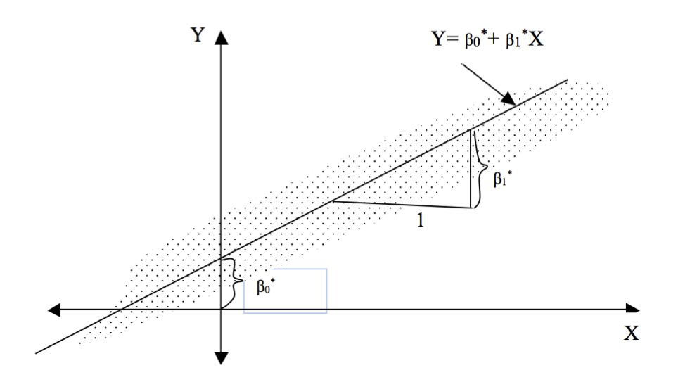
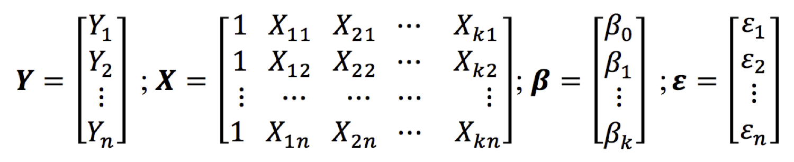
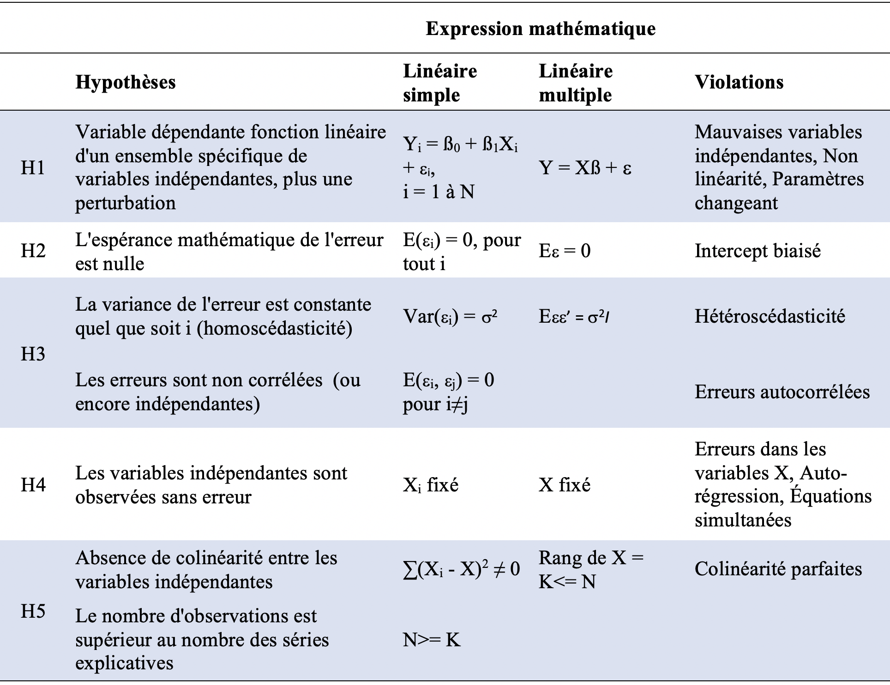
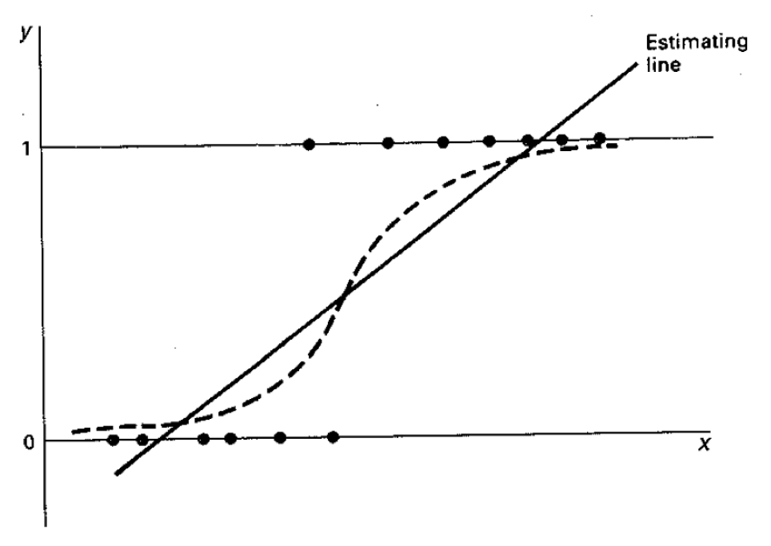
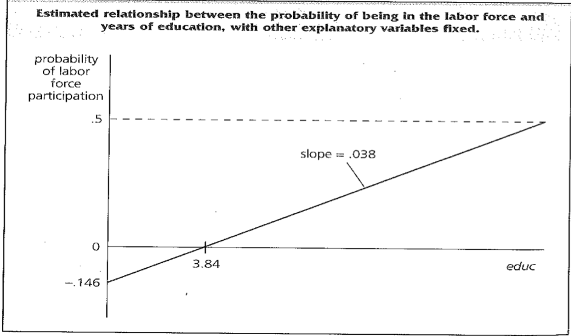
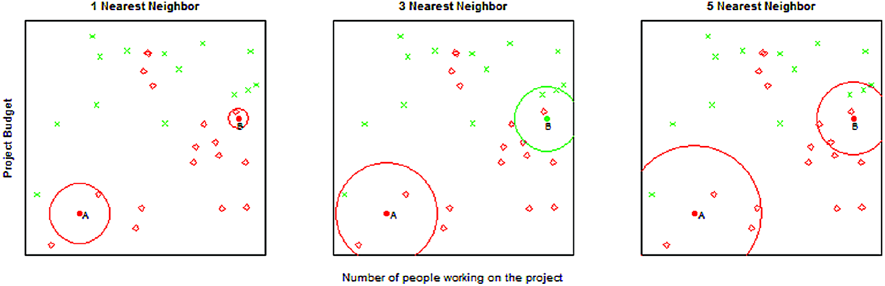
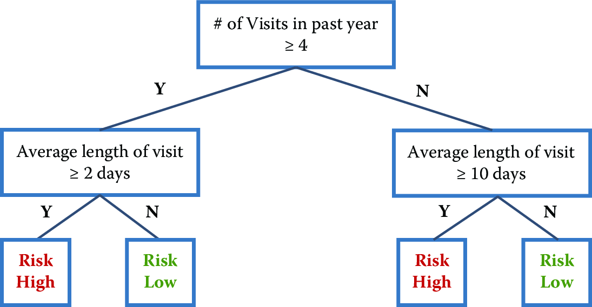

## Plan de présentation

1. Introduction

2. Modèle de régression linéaire

3. Modèle de régression régularisé

4. Modèle de régression logistique

5. KNN

6. Méthodes des arbres


## Apprentissage supervisé : introduction

- Nous abordons maintenant le problème de l'apprentissage supervisé, qui implique généralement des méthodes de **classification**, de **prédiction** et de **régression**.

- En général, les méthodes d'apprentissage supervisé prennent en entrée des paires de points de données $(X,Y)$ où $X$ représente les variables prédictives (caractéristiques) et $Y$ est la variable cible (étiquette).

- La méthode d'apprentissage supervisé utilise ensuite ces paires comme données d'entraînement et apprend un modèle $F$, où $F(X)\sim Y$.

- Ce modèle $F$ est ensuite utilisé pour prédire les $Y$ pour de nouveaux points de données $X$.

## Apprentissage supervisé : introduction

- Comme mentionné précédemment, l'objectif n'est pas de construire un modèle qui s'adapte le mieux aux données connues, mais un modèle utile pour les prédictions futures et qui **minimise l'erreur de généralisation future**.

- C'est le but principal qui différencie bon nombre des méthodes que vous connaissez des méthodes que nous décrirons ensuite.

- Pour minimiser l'erreur future, nous voulons construire des modèles qui ne **sur-apprennent** pas simplement les données passées.

## Apprentissage supervisé : introduction

- Un autre objectif, souvent priorisé dans les sciences sociales, que les méthodes d'apprentissage automatique n'optimisent pas, est d'obtenir une forme structurelle du modèle.

- Les modèles d'apprentissage automatique pour la classification peuvent prendre différentes formes structurelles (allant de modèles linéaires, à des ensembles de règles, à des formes non linéaires plus complexes), et il n'est pas toujours possible de les écrire sous une forme compacte comme une équation.

- Cela ne les rend cependant pas **incompréhensibles ou ininterprétables**.

## Apprentissage supervisé : introduction

- Un autre axe de concentration des modèles d'apprentissage automatique pour l'apprentissage supervisé est la **prédiction**, et pas nécessairement l'inférence causale <!-- ^[Le sujet de l'inférence causale est abordé plus en détail dans le chapitre Qualité des données et erreurs d'inférence.] -->.

- Certains de ces modèles peuvent être utilisés pour aider à l'inférence causale, mais ils sont généralement optimisés pour les tâches de prédiction.

- Nous croyons qu'il existe de nombreux problèmes de sciences sociales et de politique où de meilleures méthodes de prédiction peuvent être extrêmement bénéfiques [@Kleinberg2015].


- Avant de décrire les méthodes d'apprentissage supervisé, nous voulons récapituler quelques principes ainsi que des termes que nous avons utilisés et que nous utiliserons dans le reste du chapitre.

## Quelques principes

**1. Entraîner un modèle**

- Une fois que nous avons terminé l'exploration des données, **rempli les valeurs manquantes**, **créé des variables prédictives (caractéristiques)** et **décidé quelle est notre variable cible (étiquette)**, nous avons maintenant des paires de $X,Y$ pour commencer **à entraîner** (ou construire) le modèle.


**2. Utiliser le modèle pour évaluer de nouvelles données**

>- Nous construisons ce modèle afin de pouvoir prédire $Y$ pour **un nouvel ensemble** de $X$s — utiliser le modèle signifie obtenir de nouvelles données, générer les mêmes caractéristiques pour obtenir le vecteur $X$, puis appliquer le modèle pour produire $Y$.


Régression
=====================================

## 2.1.1  Régression linéaire simple

1. Définition

- Le modèle de **régression linéaire simple** peut être utilisé pour étudier la relation entre deux variables, la variable dépendante (Y) et la variable indépendante (X), comme l'exemple dont nous venons de parler.
- On parle de **régression linéaire multiple** dans le cas où il y a au moins 2 **variables indépendantes**.


## 2.1.1  Régression linéaire simple

2. Spécification

- Nous avons {Yi, Xi}, un échantillon de Y et X
- Nous sommes intéressés à **"expliquer Y en termes de X"** ou à **"étudier comment Y varie avec les changements de X"**
- Modèle

- $$ Y = \alpha + \beta X + \epsilon $$
 
  - Y = variable dépendante | variable à expliquer
 
  - X = variable indépendante | variable explicative | prédicteur
 
  - ($\alpha$, $\beta$) = coefficients à déterminer (on dit à estimer) | paramètres du modèle
 
  - $\epsilon$ = erreurs| termes d'erreur de moyenne nulle (unobserved error / disturbance error )


## 2.1.1.3. Interprétation

$$ Y = \alpha + \beta X + \epsilon $$
- ou une formulation alternative:

$$ E(Y|X) = \alpha + \beta X $$

- $\alpha + \beta X$ : moyenne de Y étant donnée la valeur de X 
- $\alpha$ : la valeur de Y quand X est zéro
- $\beta$ : augmentation de Y associée à une augmentation d'une unité de X

## 2.1.1.4. D'où vient le epsilon

1. Omission de l'influence d'innombrables événements fortuits
  
  - Autres covariables importantes (influences systématiques)
    - Etat nutritionnel de la mère
    - Autres petites variables non significatives avec une très légère influence irrégulière

## 2.1.1.4. D'où vient le epsilon

2. Erreur de mesure
    - Dans la variable dépendante
    - Dans la variable indépendante (plus problématique)

## 2.1.1.4. D'où vient le epsilon

3. Indétermination humaine

    - Le comportement humain est tel que les actions entreprises dans des circonstances identiques différeront de manière aléatoire

## 2.1.1.5. Spécification

```{r rline, echo=FALSE, fig.cap="", out.width = '90%'}

```

- $\beta_{0}$ = intersection à l'origine (intercept)
- $\beta_{1}$ = pente (slope) 


## 2.1.1.6. Méthodes d'estimation

- Il existe de nombreux estimateurs présentant des caractéristiques différentes susceptibles de résoudre l'équation 1. 

- La tâche de l'économètre est de trouver le meilleur **estimateur**. 

- Les deux approches les plus importantes sont:

  >1. Méthodes des moindres carrés: dans le cas d'une régression linéaire simple, il s'agit de trouver la meilleure ligne qui décrit de manière appropriée le nuage de points {Yi, Xi}.

  >2. Approche du maximum de vraisemblance

## 2.1.1.6. Méthodes d'estimation

**Méthode d'estimation: moindres carrées ordinaires**

- Estimer les paramètres du modèle à partir des données {$X_i, Y_i$}
- ($\hat{\alpha}, \hat{\beta}$) : Coefficients estimés
- $\hat{Y} = \hat{\alpha} +  \hat{\beta} X$ : Valeur prédite (predicted/fitted value)
- $\hat{\epsilon} = Y - \hat{Y}$ : Résidus (residuals)

- Minimiser la somme des carrées des résidus (SSR) : $$ SSR = \sum_{i=1}^n\hat{\epsilon}^2  = \sum_{i=1}^n(Y_i - \hat{\alpha} +  \hat{\beta X_i})^2 $$

## 2.1.1.6. Méthodes d'estimation

- Solution
- Coefficients estimés : $$\hat{\alpha} = \bar{Y} -  \hat{\beta} \bar{X}$$

$$\hat{\beta} = \frac{\sum_{i=1}^n(Y_i - \bar{Y})(X_i - \bar{X})}{\sum_{i=1}^n(X_i - \bar{X})^2}$$

- la droite des moindres carrées passe toujours par les points ($\bar{X}, \bar{Y}$)
- $\hat{Y} = \bar{Y}$
- la moyenne des résidus est toujours égale à zéro


## 2.1.2. Régression linéaire multiple

1. Introduction

- La régression linéaire simple ne permet pas de déduire une causalité: la réalité est plus complexe
- Permet de comprendre le concept de régression
- En cas de plus d'une variable indépendante, on parle de régression linéaire multiple

## 2.1.2. Régression linéaire multiple

2. Spécification

$$ Y_i = \alpha + \beta_1 X_{1i} +  \beta_2 X_{2i} + ...+\beta_k X_{ki} +\epsilon_i$$

- Où $\epsilon_i$ suit une loi normale de moyenne 0 et de variance $\sigma^2$.
- On a k indépendantes variables pour n observations ${(Y_i, X_{11}, X_{12}, ..., X_{1k}), ..., (Y_n, X_{n1}, X_{n2}, ..., X_{nk})}$.

- Exemple:
  - Y peut être le poids à la naissance
  - X1 l'age de la mère à la naissance de l'enfant
  - X2 le sexe de l'enfant

## 2.1.2. Régression linéaire multiple

**2. Spécification**

$$ Y_i = \alpha + \beta_1 X_{1i} +  \beta_2 X_{2i} + ...+\beta_k X_{ki} +\epsilon_i$$

- Votre tâche: estimer l’effet de chaque variable X spécifique sur Y, en contrôlant l’effet des autres.
- Cette équation peut être récrite :

- $Y_1 = \alpha + \beta_1 X_{11} + \beta_2 X_{21} + ... + \beta_k X_{k1} + \epsilon_1$
- $Y_2 = \alpha + \beta_1 X_{12} + \beta_2 X_{22} + ... + \beta_k X_{k2} + \epsilon_2$
- ...
- $Y_n = \alpha + \beta_1 X_{1n} + \beta_2 X_{2n} + ... + \beta_k X_{kn} + \epsilon_n$

- Cette façon d’écrire les équations est difficile à manipuler:

- Notation matricielle: $Y = X\beta + \epsilon$

## 2.1.2. Régression linéaire multiple

**2. Spécification**

- 


## 2.1.2.3. Estimation des paramètres


## 1. Hypothèses


```{r, out.width="70%"}

```


- Les paramètres inconnus:
  - k (beta) + 1 (alpha) paramètres
  - $\sigma^2$

- Estimation par les moindres carrés ordinaires ou la méthode des maximums de vraisemblance: Plus difficile à estimer.


## **2. Estimation**

- On démontre que :

- $\beta^* = (X^{'}X)^{-1}(X^{'}Y)$

- Variance-covariance de $\beta^* = \sigma^2(X^{'}X)^{-1}$

- Mais encore une fois, $\sigma^2$ n'est pas connu.
- Il est remplacé par:

- $s^2 = e^{'}e/(T-k)$

- avec (e = Y-Y')


## 2.1.2.4. Évaluation des performances

- MSE: La formule du MSE (Mean Squared Error, ou Erreur Quadratique Moyenne en français) est la suivante :

$$MSE = \frac{1}{n}\sum_{i = 1}^n(y_i - \hat{y_i})^2$$

- Le MSE est une mesure de la qualité d'un modèle de prédiction. 

## 2.1.2.4. Évaluation des performances

- Voici ce que le MSE indique :

**1. Erreur Moyenne** : Le MSE calcule la moyenne des carrés des erreurs de prédiction. Chaque erreur est la différence entre la valeur réelle et la valeur prédite $(y_i - \hat{y_i}$

**2. Sensibilité aux Grandes Erreurs** : En élevant les erreurs au carré, le MSE attribue plus de poids aux grandes erreurs par rapport aux petites erreurs. Cela signifie que le MSE est particulièrement sensible aux grandes erreurs de prédiction, ce qui peut être utile pour identifier des modèles qui parfois font de grosses erreurs.

**3. Échelle** : Le MSE est exprimé dans les mêmes unités que la variable à prédire, mais élevé au carré. Par exemple, si vous prédisez des distances en mètres, le MSE sera en mètres carrés. Cela peut parfois rendre l'interprétation directe du MSE difficile.

## 2.1.2.4. Évaluation des performances

Lors de la validation d'un modèle de prédiction, le MSE est couramment utilisé pour les raisons suivantes :

**1. Comparaison de Modèles** : En comparant le MSE de différents modèles, vous pouvez identifier lequel a, en moyenne, les prédictions les plus proches des valeurs réelles. Un modèle avec un MSE plus faible est généralement considéré comme ayant de meilleures performances de prédiction.

**2. Évaluation de la Performance** : Le MSE fournit une seule valeur résumée qui peut être utilisée pour évaluer la performance globale du modèle sur l'ensemble des données de test.

**3. Optimisation** : Lors de l'ajustement des hyperparamètres de modèles (comme en utilisant des techniques de validation croisée), le MSE peut être utilisé comme critère d'optimisation pour trouver les meilleurs paramètres qui minimisent l'erreur de prédiction.

## 2.1.2.4. Évaluation des performances

- $R^2$


## 2.1.3. Les méthodes de régularisation

## Introduction : pourquoi la régularisation ?

- Les moodèles de regresssion classique peuvent souvent conduire à un surajustement(overfitting)
- Le surapprentissage peut être causé par la présence de variables inutiles ou redondadantes, ou par une quantitité insuffisante de donnée d'entrainement.
- Les modèles pénalisés, sont des techniques de régularisation qui permettent de limiter le surajustement en ajoutant des termes de pénalité à la fonction de coût de la régression. 


## Introduction : pourquoi la régularisation ?

- Les termes de pénalité encouragent le modèle à avoir des coefficients plus petits, ce qui reduit la complexité du modèle et limite l'influence des variables inutiles ou redondantes. 

- Les modèles pénalisés permettent également de sélectionner automatiquement les variables les plus importantes, ce qui peut améliorer la compréhension du modèle et la qualité des prédictions. 

- Les modèles pénalisés sont particulièrement utiles lorsque le nombre de variables indépendantes est élevé ou lorsque les données d"entrainement sont limitées. 

- En resumé, les modèles pénalisés sont une technique importante pour limiter l'overffiting et améliorer la généralisation des modèles de régression

## Types de régularisation

1. Régression ridge
2. Régression Lasso
3. Régression Elastic Net

## Régression Ridge ou L2

1. Principe de la régularisation L2
- La régression Ridge ajoute une pénalité L2 à la fonction de coût
- La pénalité L2 ajoute une contrainte sur les coefficients de régression, en les limitants à des valeurs proche de Zéro
- Ridge permet de réduire la variance du modèle et améliorer la capacité à généraliser

## Régression Ridge ou L2

2. Fonction de coût

$$
\sum_{i=1}^n{(Y_i - X\beta|_i)^2}+ \lambda \sum_{j=1}^p \beta_j^2, 0 \leq \lambda \leq 1.
$$
- Faire une régression Ridge c'est donc résoudre le problème d'optimisation suivant :

$$
\text{Minimiser} \sum_{i=1}^n{(Y_i - X\beta|_i)^2} \text{sous la contrainte} \sum_{j=1}^p \beta_j^2 \leq s
$$


## Régression Lasso OU L1

1. Principe de la régularisation L1

- La régression Lasso ajoute une pénalité L1 à la fonction de coût de la régression. 
- La pénalité L1 impose une contrainte plus forte sur les coefficients de régression, *en les poussant à zéro pour  certains coefficients.*
- Cette méthode permet de selectionner automatiquement les variables les plus importantes et de réduire la dimensionnalité du modèle. 


## Régression Lasso OU L1

2. Fonction de coût

$$
\sum_{i=1}^n{(Y_i - X\beta|_i)^2}+ \lambda \sum_{j=1}^p |\beta_j|, 0 \leq \lambda \leq 1.
$$

- Faire une régression Lasso c'est donc résoudre le problème d'optimisation suivant :

$$
\text{Minimiser} \sum_{i=1}^n{(Y_i - X\beta|_i)^2} \text{sous la contrainte} \sum_{j=1}^p |\beta_j| \leq s
$$

## Régression Elastic Net

- Elastic Net est une Combinaison de la régularisation L1 et L2
- Sa fonction de coût est : 

$$
 \sum_{i=1}^n{(Y_i - X\beta|_i)^2}+ (1 - \alpha) ( \sum_{j=1}^p \ \beta_j^2 )  + (\alpha) ( \lambda \sum_{j=1}^p \ |\beta_j|  )
$$

- Cette méthode permet de combiner les avantages de la régression Ridge et Lasso, en *réduisant la variance du modèle et en sélectionnant les variables les plus importantes.*

- Avantages par rapport aux autres méthodes

## Méthodes d'estimation

- Méthode des moindres carrés
- Méthode de descente de gradient

## Comparaison des méthodes

- Forces et faiblesses de chaque méthode
- Choix en fonction du contexte

## Exemple pratique

- Application des régressions régularisées sur un jeu de données
- Comparaison des résultats avec la régression classique

## Conclusion

- Avantages des régressions régularisées
- Utilisation dans différents domaines

## Ressources supplémentaires pour approfondir le sujet

- <https://glmnet.stanford.edu/articles/glmnet.html>

- <https://github.com/Labo-Lacourse/Code_chap_23_logistic_regression_regularization>


Modèles de classification
=============================================

## Introduction

- Nous nous concentrerons maintenant sur les méthodes de classification dans ce chapitre, car bon nombre des méthodes de régression en apprentissage automatique sont assez similaires aux méthodes que vous connaissez déjà.

- Rappelez-vous que la classification signifie prédire une variable discrète (ou catégorielle).

- La plupart des méthodes de classification que nous aborderons peuvent également être utilisées pour la régression (prédire des résultats continus).


## 2.2.1. Introduction

- La variable dépendante dichotomique est un cas particulier de variable dépendante qualitative où la variable dépendante n'a que deux catégories
  - Succès / perte, malade ou non, entrée dans la sexualité ou non
- Variable dépendante qualitative

- L'analyse de régression d'une variable qualitative binaire ou dichotomique est un problème courant en sociologie
- Ces modèles se concentrent sur les déterminants de la probabilité p d'occurrence d'un résultat plutôt que d'un autre résultat qui se produit avec une probabilité de 1-p.

## 2.2.1. Introduction

- Exemples:

   - Modéliser si le premier rapport sexuel a eu lieu pendant l'adolescence ou non
   - Modéliser si une personne a utilisé une méthode de contraception moderne ou pas
   - Donnez-moi d'autres exemples

## 2.2.2. Estimation

- Dans l'analyse de régression, nous voulons mesurer comment la probabilité p varie d'un individu à l'autre en fonction des régresseurs (variables indépendantes0.

- Trois principales approches d'estimation sont utilisées:

> 1. Le modèle de probabilité linéaire: souvent dans le cas d'un régresseur endogène
> 2. Le modèle logit
> 3. Le modèle probit

## 2.2.2.1. Le modèle de probabilité linéaire

>- $Y_i = \beta_0 + \beta_1X_i + ... + \beta_kX_k + \epsilon+j$

>- Parce que Y ne peut prendre que deux valeurs, $\beta_j$ ne peut pas être interprété comme le changement de Y étant donné une augmentation d'une unité de $X_j$, en maintenant tous les autres facteurs fixes: Y passe de 0 à 1, ou de 1 à 0 (ou ne change pas).

>- Le modèle de régression linéaire multiple avec une variable dépendante binaire est appelé le modèle de probabilité linéaire (LPM) car la probabilité de réponse est linéaire dans les paramètres $\beta_j$.

## 2.2.2.1. Le modèle de probabilité linéaire

```{r, echo=FALSE, out.width='80%', warning=FALSE, message=FALSE}



```


- Il est évident que la droite d'estimation n'est pas appropriée pour traiter la variable dépendante dichotomique

## 2.2.2.1. Le modèle de probabilité linéaire

- Formulation

- $Y_i = \beta_0 + \beta_1X_i + ... + \beta_kX_k + \epsilon_i$
- $Y_i = \beta_0 + \beta_1X_i + \epsilon_i$ (simple régression linéaire)
- $Y = X\beta + \epsilon$ sous la forme matricielle
- $E(Y|X) = \beta_0 + \beta_1X_i + ... + \beta_kX_k$
- Que vaut $E(Y|X)$ ?

## 2.2.2.1. Le modèle de probabilité linéaire

- Si Y est discrète:
- $E(Y|X) =  \sum_kkP(Y = k|X)$
- Y variable dichotomique prend les valeurs 0 et 1
- $E(Y|X) =  0*P(Y = 0|X) + 1*(Y = 1|X)$

- ==> E(Y|X) = P(Y = 1|X)

>- donc, E(Y|X) est interprété comme une probabilité

>- $\beta_j$ mesure le changement de la probabilité de succès lorsque $X_j$ change, en maintenant les autres facteurs fixes

## 2.2.2.1. Le modèle de probabilité linéaire

- Exemple: calcul de l'espérance quand Y est discrète
- Soit la variable aléatoire age qui a la distribution suivante:

Age    Nombre de cas
----   -----------------
10     5
11     6
12     4

## 2.2.2.1. Le modèle de probabilité linéaire

>- Quelle est l'espérance de Y (moyenne de Y)

>- M = (5\*10 + 11\*6 +4\*12)/15


- Vous pouvez vous rendre compte que cela est exactement:

- E(Y) = 10\*P(Y=10) + 11\*P(Y=11) + 12\*P(Y=12)
- P(Y=10) = 5/15 
- P(Y=11) = 6/15 
- P(Y=12) = 4/15 

- ==> E(Y) = 10\*5/15 + 11\*6/15 + 12\*4/15

## 2.2.2.1. Le modèle de probabilité linéaire

- Deux principaux problèmes avec le LPM: 


> 1. La probabilité prédite est supérieure à 1 ou inférieure à 0

> 2. Les termes d'erreurs sont hétéroscédastiques

## 2.2.2.1. Le modèle de probabilité linéaire

1. Les valeurs prédites sont illimitées

```{r, echo=FALSE, out.width='80%', warning=FALSE, message=FALSE}



```


## 2.2.2.1. Le modèle de probabilité linéaire

2. Les termes d'erreurs sont hétéroscédastiques

- $\epsilon_i$ prend deux valeurs:
- $-X\beta$ si Y = 0 avec P(Y = 0) = $1- X\beta$
- $(1-X\beta)$ si Y = 1 avec P(Y = 1) = $X\beta$


Valeur de $\epsilon$       Probabilité
-------------------------- --------------------
$-X\beta$                  $1- X\beta$
$(1-X\beta)$               $X\beta$


## 2.2.2.1. Le modèle de probabilité linéaire

>- $E(\epsilon) = -X\beta * (1- X\beta) + (1-X\beta) * X\beta$ = 0

>- $Var(\epsilon) = (-X\beta)^2 * (1- X\beta) + (1-X\beta)^2 * X\beta = X\beta(1-X\beta)$

>- $Var(\epsilon)$ n'est pas constante


## 2.2.2.1. Le modèle de probabilité linéaire


- Ces deux problèmes ne sont pas insurmontables:

  - Changer la valeur des valeurs prédites

    - 0 pour toutes les valeurs négatives

    - 1 pour toutes les valeurs supérieures à 1

- Estimation en contrôlant l'hétéroscédasticité


## 2.2.2.1. Le modèle de probabilité linéaire


```{r, echo=FALSE, out.width='60%', warning=FALSE, message=FALSE}


```


>- Ce qu'il faut, c'est un moyen de "presser" les probabilités estimées à l'intérieur de l'intervalle 0-1

>- $P(Y = 1) = G(Y_i = \beta_0 + \beta_1X_i + ... + \beta_kX_k$)


## 2.2.2.1. Modèle Logit / Probit

- $P(Y = 1) = G(\beta_0 + \beta_1X_i + ... + \beta_kX_k$)

- De nombreuses fonctions sont disponibles
- Les deux plus populaires sont:
  - La fonction normale cumulative qui donne le modèle probit
  - La fonction logistique qui donne le modèle logit

- Le modèle log-log complémentaire pour la distribution non symétrique
    - Pour les phénomènes rares, où la probabilité de succès est faible


## 2.2.2.1. Modèle Logit / Probit

**1. Formulation**

- Forme latente

- $Y_i^* = \beta_0 + \beta_1X_{1i} + ... + \beta_kX_{ki} + \epsilon_i$, i allant de 1 à n

- On observe :
    - $Y_i = 1$ si $Y_i^* > 0$
    - $Y_i = 0$ si $Y_i^* < 0$

>- $P(Y_i = 1) = P(Y_i^* > 0) = P(X\beta + \epsilon > 0)$

>- $P(Y_i = 1) = P(\epsilon > -X\beta)$

>- $P(Y_i = 1) = P(\epsilon < X\beta) = \psi(Y_i^*)$

>- Où $\psi$ est la fonction de distribution cumulative 


## 2.2.2.1. Modèle Logit / Probit

**2. Estimation**

- Les techniques du maximum de vraisemblance sont utilisées pour estimer les paramètres
- Pour chaque observation, la probabilité d'observation Y conditionnelle à X peut s'écrire:
- $P(Y_i = y_i|X) = {\psi(x_i\beta)}^{y_i}{(1 - \psi(x_i\beta))}^{1-y_i}$ avec $\text{$y_i$ = 0 ou 1}$

- Le logarithme de la vraisemblance de l'observation i peut s'écrire:
- $l_i(\beta) = y_ilog[\psi(x_i\beta)] + (1-y_i)log[(1 - \psi(x_i\beta)]$
- Et la vraisemblance de l'échantillon vaut:

$$L(\beta) = \sum l_i(\beta)$$

## 2.2.2.1. Modèle Logit / Probit

**- Logit**

- La fonction de distribution cumulative est la fonction logistique:
- $\psi(t) = \frac{exp(t)}{1 + exp(t)}$
- $P(Y = 1 | x) = \pi_i = \frac{exp(x\beta)}{1 + exp(x\beta)}$
- $logit(\pi_i) = Log(\frac{\pi_i}{1-\pi_i}) = \beta_0 + \beta_1X_{1i} + ... + \beta_kX_{ki}$


## 2.2.2.1. Modèle Logit / Probit

**- Probit**

- La fonction de densité cumulée est la fonction normale:
- $G(t) = \frac{1}{\sqrt{2\pi}}\int_{-\infty}^{t} e^{-\frac{1}{2}x^2}dx$
- $P(Y = 1) = G(X\beta)$
- $G^{-1}[P = 1] = \beta_0 + \beta_1X_{1i} + ... + \beta_kX_{ki}$

## 2.2.2.1. Modèle Logit / Probit

**3. Choix entre les deux modèles:**

- Les deux fonctions sont très similaires
- Le choix est une question de goût en raison de la disponibilité du logiciel
- Logit populaire dans la santé publique tandis que probit est plus populaire parmi les économistes
- Logit facilement manipulable : popularisé par la notion de rapport de chances (odd ratio) 
  

## 2.2.3. Interprétation  

**1. Logit**

- $Log(\frac{\pi_i}{1-\pi_i}) = \beta_0 + \beta_1X_{1i} + ... + \beta_kX_{ki}$
- $d(Log(\frac{\pi_i}{1-\pi_i})/d(X_{1i}))$ donne $\beta_1$
- On peut démontrer que:

$$d(\pi_i)/d(X_1) = \beta_1\pi_i(1-\pi_i)$$

>- $\beta_1$ n'explique pas le changement de probabilité dû à un changement d'unité dans la variable $X_1$

>- $d(\pi_i)/d(X_1)$ dépend de la valeur des autres variables du modèle

>- Pour interpréter l'effet de $X_1$, il faut aussi fixer $\pi_i(1-\pi_i)$

## 2.2.3. Interprétation  

**Logit** : Interprétation alternative

>- Odd ratio ou rapport de chances

>- $Log(\frac{\pi_i}{1-\pi_i}) = \beta_0 + \beta_1X_{1i} + ... + \beta_kX_{ki}$

>- $\frac{\pi_i}{1-\pi_i} = exp(\beta_0 + \beta_1X_{1i} + ... + \beta_kX_{ki})$

>- $\frac{\pi_i}{1-\pi_i} = exp(\beta_0)exp(\beta_1X_{1i})* ... *exp(\beta_kX_{ki})$

>- C'est ce qu'on appelle une chance ou une côte

>- Si vous faites varier $X_1$ de 0 à 1, vous pouvez calculer le rapport de cette côte.

## 2.2.3. Interprétation  

**2. Probit**

- $P(Y = 1) = \pi_i = G(X\beta)$
- $d(\pi_i)/d(X_1) = \beta_1G^{'}(X\beta)$
- Plus difficile que le modèle logit


## 2.2.4. Autres éléments à considérer

**1. Violation des hypothèses**

- Toutes violations d'hypothèses comme dans le cas d'un modèle linéaire affectent les estimations et leurs erreurs standards
  - Variables omises
  - Hétéroscédasticité
  - Multicolinéarité
  - Endogénéité...

## 2.2.4. Autres éléments à considérer

**2. Mesure de la "qualité d'ajustement"**

- En régression linéaire, ce rôle est joué par $R^2$ ou $pseudo-R^2$.
- $R^2$ ou pseudo $R^2$ ne conviennent pas dans le cas de modèle logit ou probit


## 2.2.4. Autres éléments à considérer

**2. Mesure de la "qualité d'ajustement"**

**Alternative**:

- Tableau calculant le nombre de valeurs Y = 1 correctement et incorrectement prédites et le nombre de valeurs Y = 0 correctement et incorrectement prédites
- Une observation est prédite comme Y = 1 si la probabilité estimée dépasse une valeur fixe (souvent la moitié)
- Doit être utilisé avec prudence

## 2.2.5. Conclusion

**C'est la première technique de classification.**

- Voici un aperçu de certaines des autres méthodes utilisées en apprentissage automatique.
- Il est important de se rappeler qu'à mesure que vous utilisez des méthodes de classification de plus en plus puissantes, vous avez besoin de plus de données pour entraîner les modèles.

## 2.3. k-voisin le plus proche (k-nearest neighbor)

- La méthode $k$ plus proches voisins ($k$-NN) est l'une des méthodes de classification les plus simples en apprentissage automatique.

- Elle appartient à une famille de modèles parfois connus sous le nom de **modèles basés sur la mémoire** ou de **modèles basés sur les instances**.

- Un exemple est classé en trouvant ses $k$ plus proches voisins et en prenant un vote majoritaire (ou une autre fonction d'agrégation).

## 2.3. k-voisin le plus proche (k-nearest neighbor)

- Nous avons besoin de deux éléments clés : une valeur pour $k$ et une métrique de distance pour trouver les $k$ plus proches voisins.
- En général, différentes valeurs de $k$ sont utilisées pour trouver empiriquement la meilleure.
- De petites valeurs de $k$ conduisent à des prédictions ayant une forte variance mais peuvent capturer la structure locale des données.
- De plus grandes valeurs de $k$ construisent des modèles plus globaux qui ont une variance plus faible mais peuvent ne pas aussi bien capturer la structure locale des données.

## 2.3. k-voisin le plus proche (k-nearest neighbor)

- La Figure @ref(fig) fournit un exemple pour $k = 1, 3, 5$ plus proches voisins.
- Le nombre de voisins ($k$) est un paramètre, et la prédiction dépend fortement de la manière dont il est déterminé.
- Dans cet exemple, le point B est classé différemment si $k = 3$.

```{r knn, out.width = '70%', fig.align = 'center', echo = FALSE, fig.cap = 'Exemple de la méthode des $k$-plus proches voisins avec $k = 1, 3, 5$ voisins. Nous voulons prédire les points A et B. Le plus proche voisin pour les deux points est rouge (« Brevet non accordé »), les 3-plus proches voisins prédisent que le point A (B) sera rouge (vert) avec une probabilité de 2/3, et les 5-plus proches voisins prédisent de nouveau que les deux points seront rouges avec des probabilités respectives de 4/5 et 3/5'}



```


- <!--Example of $k$-nearest neighbor with $k = 1, 3, 5$ neighbors.
- We want to predict the points A and B.
- The 1-nearest neighbor for both points is red ("Patent not granted"), the 3-nearest neighbor predicts point A (B) to be red (green) with probability 2/3, and the 5-nearest neighbor predicts again both points to be red with probabilities 4/5 and 3/5, respectively.-->

## 2.3. k-voisin le plus proche (k-nearest neighbor)

- L'entraînement pour $k$-NN consiste simplement à stocker les données, ce qui rend cette méthode utile dans les applications où les données arrivent très rapidement et où un modèle doit être mis à jour fréquemment.

- Cependant, tout le travail se fait au moment de l'évaluation, car tous les calculs de distance se produisent lorsqu'un nouveau point de données doit être classé.

- Il existe plusieurs méthodes optimisées conçues pour rendre $k$-NN plus efficace, et qui méritent d'être explorées si cela correspond à votre problème.

## 2.3. k-voisin le plus proche (k-nearest neighbor)

- En plus de sélectionner $k$ et une métrique de distance appropriée, nous devons également faire attention à **l'échelle des caractéristiques**.

- Lorsque les distances entre deux points de données sont grandes pour une caractéristique et petites pour une autre, la méthode se fiera presque exclusivement à la première caractéristique pour trouver les points les plus proches.

- Les petites distances sur la seconde caractéristique sont presque inutiles pour calculer la distance globale.

## 2.3. k-voisin le plus proche (k-nearest neighbor)

- Un problème similaire se pose lorsque des **prédicteurs continus et catégoriels** sont utilisés ensemble.

- Pour résoudre les problèmes d'échelle, il existe plusieurs options de mise à l'échelle.

- Par exemple, une approche courante consiste à **centrer toutes les caractéristiques** à une moyenne de $0$ et à les mettre à l'échelle pour une variance de $1$.

## 2.3. k-voisin le plus proche (k-nearest neighbor)

- Il existe plusieurs variantes de $k$-NN.

- L'une d'elles est les **plus proches voisins pondérés**, où différentes caractéristiques sont pondérées différemment ou où différents exemples sont pondérés en fonction de la distance par rapport à l'exemple à classer.

## 2.3. k-voisin le plus proche (k-nearest neighbor)

- La méthode $k$-NN rencontre également des problèmes lorsque les données sont rares et de haute dimensionnalité, ce qui signifie que chaque point est éloigné de pratiquement tous les autres points, et donc les distances par paires tendent à être non informatives.

- Cela peut aussi se produire lorsqu'un grand nombre de caractéristiques sont non pertinentes et masquent le signal des caractéristiques pertinentes dans les calculs de distance.

## 2.3. k-voisin le plus proche (k-nearest neighbor)

- Notez que la méthode des plus proches voisins peut facilement être appliquée aux problèmes de régression avec une variable cible à valeur réelle.

- En fait, la méthode est complètement indifférente au type de variable cible et peut potentiellement être utilisée pour prédire des documents texte, des images et des vidéos, en fonction de la fonction d'agrégation après avoir trouvé les plus proches voisins.


## 2.5. Arbres de décision (Decision trees)

- Les arbres de décision sont une autre série de méthodes utiles pour la prédiction.
- Les arbres de décision typiques apprennent un ensemble de règles à partir de données d'entraînement représentées sous forme d'arbre.

## 2.5. Arbres de décision (Decision trees)

- Un exemple d'arbre de décision est montré dans la Figure @ref(fig).


```{r tree_r, out.width = '70%', fig.align = 'center', echo = FALSE}

```

## 2.5. Arbres de décision (Decision trees)

- Chaque niveau d'un arbre divise l'arbre pour créer une branche en utilisant une caractéristique et une valeur (ou une plage de valeurs).

- Dans l'arbre d'exemple, la première division est effectuée sur la caractéristique nombre de visites au cours de l'année passée et la valeur $4$.

- Le deuxième niveau de l'arbre comporte maintenant deux divisions : l'une utilisant durée moyenne de la visite avec la valeur $2$ jours et l'autre avec la valeur $10$ jours.


## Qu'est-ce qu'un modèle d'apprentissage automatique en arbre ?

- Définition : Un modèle d'apprentissage automatique en arbre est une méthode d'apprentissage supervisé qui utilise une structure arborescente pour prendre des décisions ou effectuer des prédictions.
- Caractéristiques : Les modèles en arbre sont faciles à comprendre, interprétables et adaptés à la fois pour des problèmes de classification et de régression.

## Arbre de décision

- Définition : Un arbre de décision est un modèle en arbre qui représente les décisions et leurs conséquences sous forme d'arbre.
- Fonctionnement : L'arbre est construit de manière récursive en divisant les données en fonction de certaines caractéristiques jusqu'à obtenir des feuilles contenant des résultats finaux.
- Avantages : Interprétabilité, prise de décision transparente, robustesse aux valeurs manquantes.

## Arbre de décision (suite)

- Limitations : Tendance à l'overfitting (surapprentissage) sur des ensembles de données complexes, sensibilité aux variations mineures des données d'entraînement.


## 2.6 Random Forest

- Définition : La Random Forest est un modèle en ensemble (ensemble learning) qui combine plusieurs arbres de décision.
- Fonctionnement : Chaque arbre est entraîné sur un sous-ensemble aléatoire des données et des caractéristiques, et les prédictions sont agrégées pour produire un résultat final.
- Avantages : Réduction de l'overfitting grâce à la combinaison de multiples arbres, performances élevées, robustesse aux valeurs aberrantes.

## Random Forest (suite)

- Utilisations : Classification, régression, détection d'anomalies, sélection de variables.
- Importance des caractéristiques : Les Random Forests permettent de calculer l'importance relative des différentes caractéristiques dans la prédiction.

## Comparaison entre l'arbre de décision et la Random Forest

- Complexité : L'arbre de décision est plus simple et interprétable, tandis que la Random Forest est plus complexe mais souvent plus précise.
- Overfitting : L'arbre de décision a tendance à l'overfitting, tandis que la Random Forest le réduit.
- Adaptabilité : L'arbre de décision peut être adapté facilement, tandis que la Random Forest nécessite plus de ressources et de paramétrages.

## Ressources


## Labo
